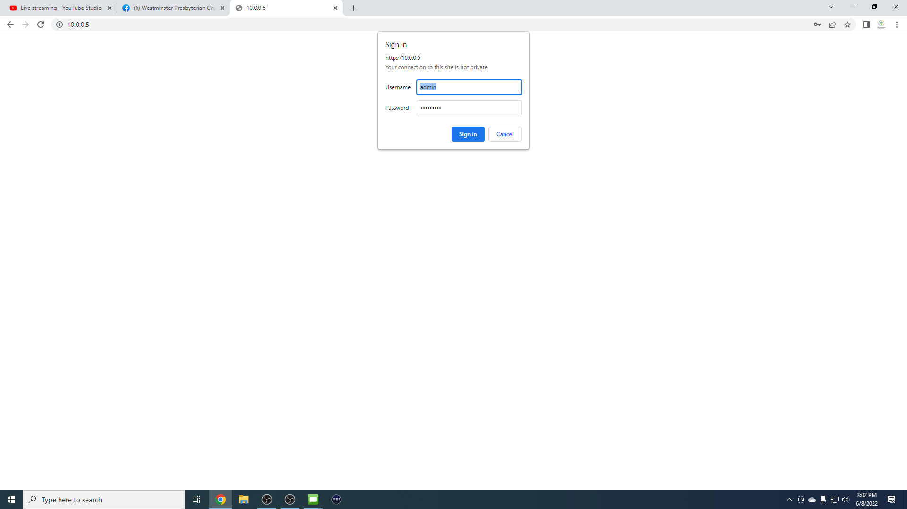

# PTZ Camera Presets

The PTZ camera in the back of the sanctuary has up to 256 presets for where the camera is pointed. Follow the steps below to set camera presets.

---

## 1. Log Into Camera Web Interface
 - The first step is to log into the web interface for the PTZ Camera. To accomplish this task go to 10.0.0.5 in your web browser. This can only be done on a device that is connected to the WPC_Cameras or WPC_Cameras-5G networks or connected to the Netgear router above the tech desk via an ethernet cable.
 
 - The username and password are included on the password file.

## 2. Set The Position of the Camera