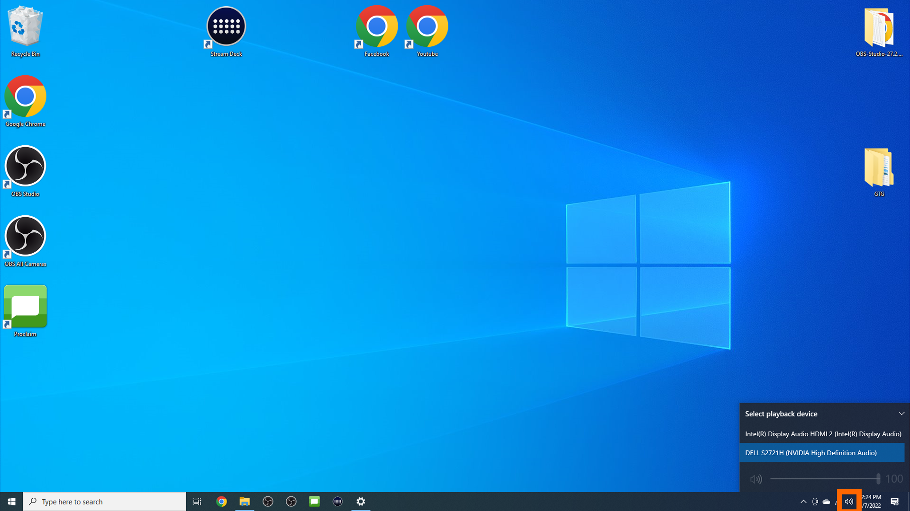
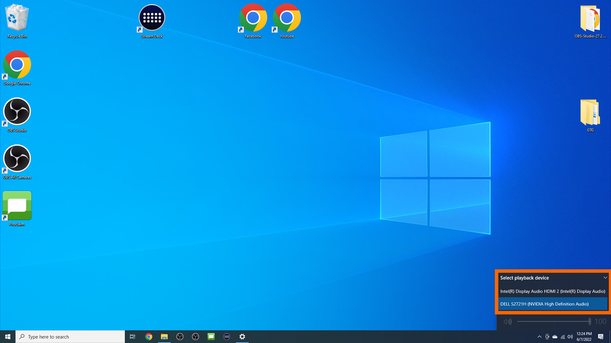

# Changing the Audio Output Device

It can be necessary to change the audio output between the center monitor and the Mackey Hall sound system. Follow the steps below to change the audio output device.

---

## 1. Select Speaker Icon
 - Click the speaker icon in the bottom right of the center screen to open the volume settings.
 

## 2. Select Playback Device Dropdown
 - Just above the volume slider, select the menu to bring up all the audio output devices.
 - This will show one of the following devices:
    - Intel(R) Display Audio HDMI 2 (Intel(R) Display Audio)
        - *HDMI Output for Projector and Sound System*
    - DELL S2721H (NVIDIA High Definition Audio)
        - *HDMI Output for Center Monitor Video and Audio*
 - After opening the dropdown, it will show all audio output devices.
 

## 3. Select Output Location
 - According to the list below, select where you want the audio to be output to:

    | Sound System | Desktop Monitor |
    |--------------|-----------------|
    | Intel(R) Display Audio HDMI 2 (Intel(R) Display Audio)           | DELL S2721H (NVIDIA High Definition Audio)              |
