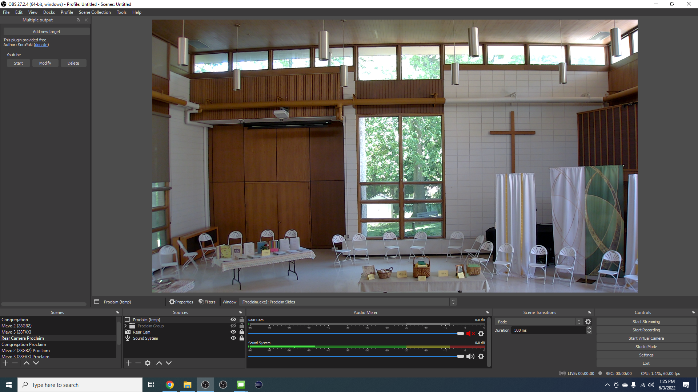

# Fixing Proclaim for Livestreaming

OBS Studio and capturing Proclaim is currently having some issues that an effective fix has yet to have been found. Each time you put Proclaim in "On Air" mode OBS Studio is not picking it up and capturing the slides. Each time you take Proclaim out of and restart "On Air" mode you will have to do this fix. Follow the instructions below to get the capture for livestreaming. 

### 1. Start "On Air" Mode in Proclaim
You can do this either with OBS open or closed.

### 2. Navigate to Rear Camera Proclaim in OBS Studio

Click on Proclaim (temp). It brings up a box between where you clicked and the video. Click the dropdown for "Window" where it says [Proclaim.exe] Proclaim Slides. Click on one of the listings in the dropdown that says [Proclaim.exe] Proclaim Slides. There will be two. If one brings up a black screen, click on the other one.

### 3. Verify that proclaim was fixed in the three Mevo scenes
If not, follow step two in the Mevo scenes.

### 3. Navigate to Full Proclaim
Follow the same steps as step two in the Full Proclaim scene for the Proclaim (temp) 2 item.

### 4. Navigate to Proclaim Muted 
Follow the same steps as step two in the Full Proclaim scene for the Proclaim (temp) 3 item.

### 5. In the all cameras view of OBS, do the same thing
Follow the same steps as step two in the Full Proclaim scene for the proclaim )temp) item.