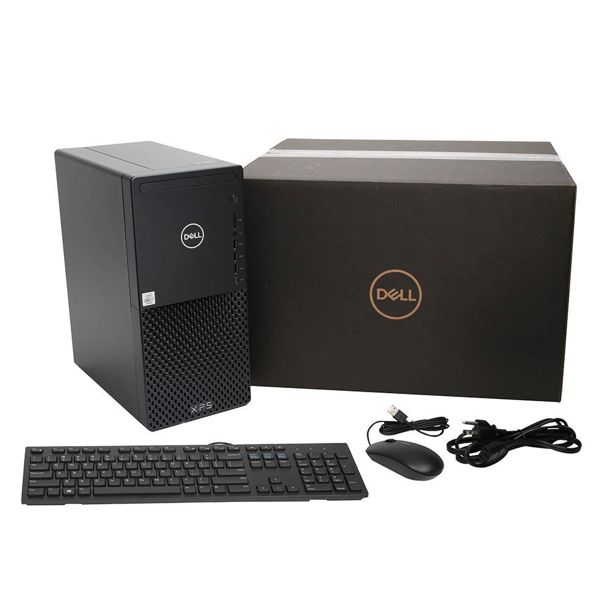
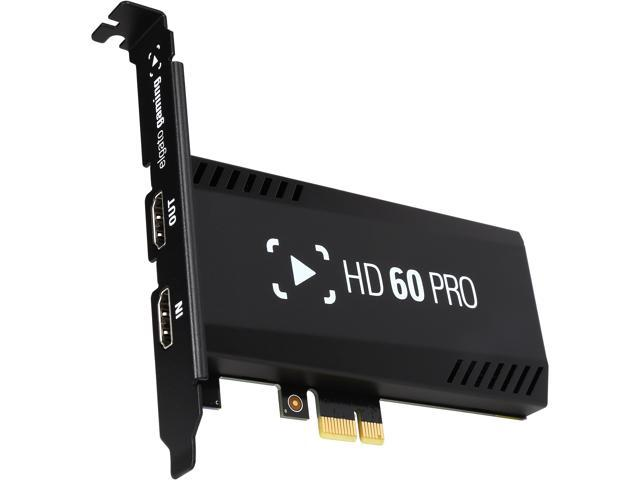
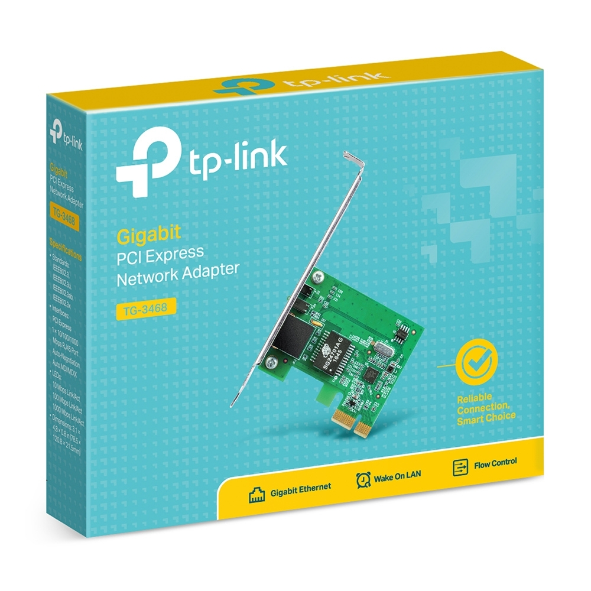
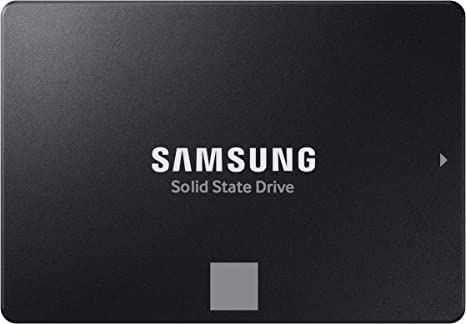
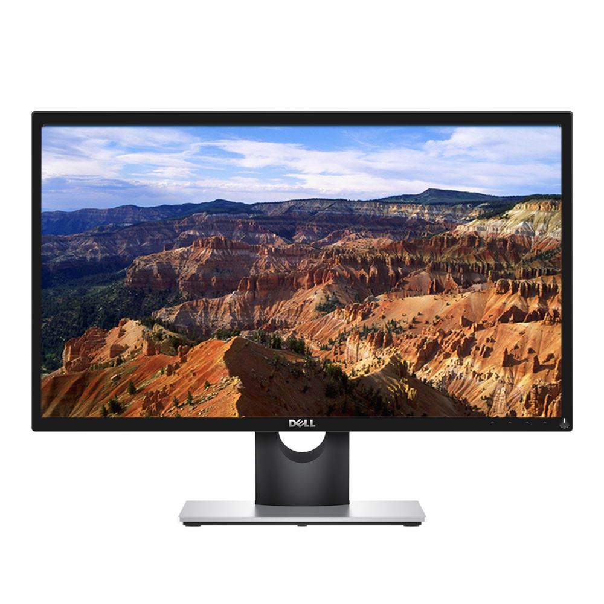
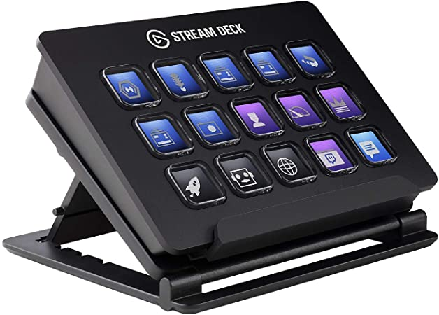
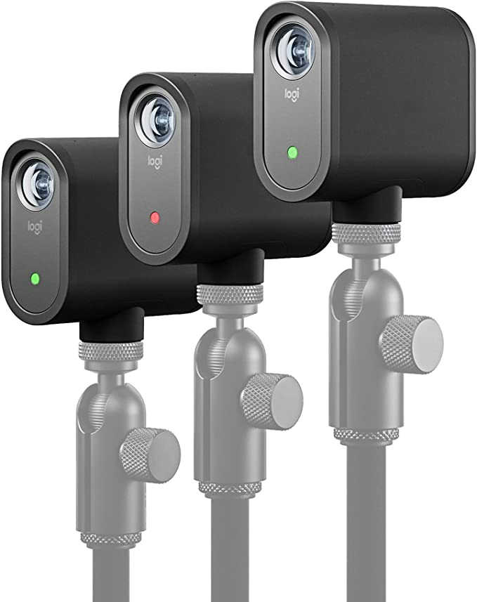
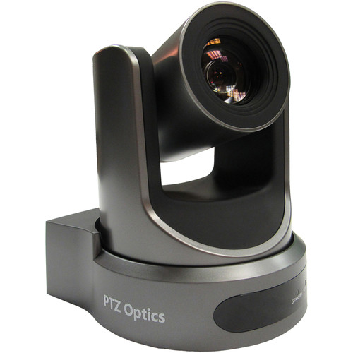

## Listing of Technology Hardware Parts

# Computer
## Dell XPS 8940 Gaming Desktop

*   Intel Core i7-10700 2.9GHz Processor
*   NVIDIA GeForce GTX 1660 Super 6GB GDDR6
*   32GB DDR4-2933 RAM
*   1TB NVMe M.2 SSD
*   Keyboard
*   Mouse
*   _**Purchased February 2021**_  
     

## Upgrades

###   Elgato Game Capture HD60 Pro
*   Captures HDMI output from PTZ Camera
*   _**Purchased Summer 2021**_  
    

###   TP-Link 10/100/1000Mbps Gigabit Ethernet PCI Express Network Card
*   Connects Ethernet from WPC_Cameras router to coputer to access Mevo cameras and PTZ Camera
*   _**Purchased May 2022**_  
    

###   Samsung 870 EVO SATA III SSD 1TB 2.5” Internal Solid State Drive
*   Drive for storage of video recordings
*   _**Purchased May 2022**_  
    

# Monitors
## Dell SE2417HGX

*   24" Monitor
*   _**Two Purchased February 2021**_  
    

## Dell S2721H

*   27" Monitor with Built-in Speakers
*   _**Purchased May 2022**_  
    

# Peripherals
## Elgato Stream Deck

*   Used to switch between OBS scenes, start recordings/livestreams/virtual camera, and operate PTZ camera presets
*   _**Purchased May 2021**_  
    

# Cameras

## Mevo Start

*   _**Set of Three Purchased May 2022**_  
    

## PTZOptics 20X-NDI Broadcast and Conference Camera

*   _**Purchased May 2022**_  
    

# Sound System & Projector

## Apple iPad

## Other to be listed in time

# Network Parts

## Netgear R6700AX

*   WPC_Cameras router
*   _**Purchased May 2022**_

## TP-Link 802.3af Gigabit PoE Injector

*   Powers PTZ Camera and provides ethernet
*   _**Purchased May 2022**_

# Cables

## Monoprice Cat6A Ethernet Patch Cable - 75 Ft

*   Ethernet cable for connecting to PTZ Camera
*   _**Purchased May 2022**_

## Monoprice Cat6A Ethernet Patch Cable - 10 Ft

*   Ethernet cable for connecting computer to WPC_Cameras router
*   _**Purchased May 2022**_

## Monoprice Cat6A Ethernet Patch Cable - 1 Ft

*   Ethernet cable for patching to PoE Injector
*   _**Purchased May 2022**_

## Cat6 Ethernet Cable

*   Ethernet cable for computer internet 
*   Originally 150 Ft, Reterminated to be shorter
*   _**Purchased May 2021**_

## Amazon Basics High-Speed Fiber Optic HDMI Cable - 100 Ft

*   Cable for connecting PTZ Camera to capture card
*   _**Purchased October 2021**_