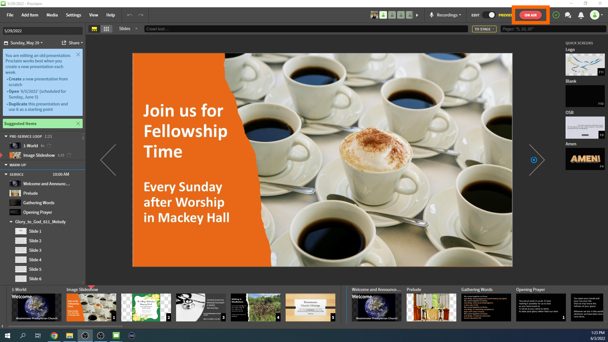
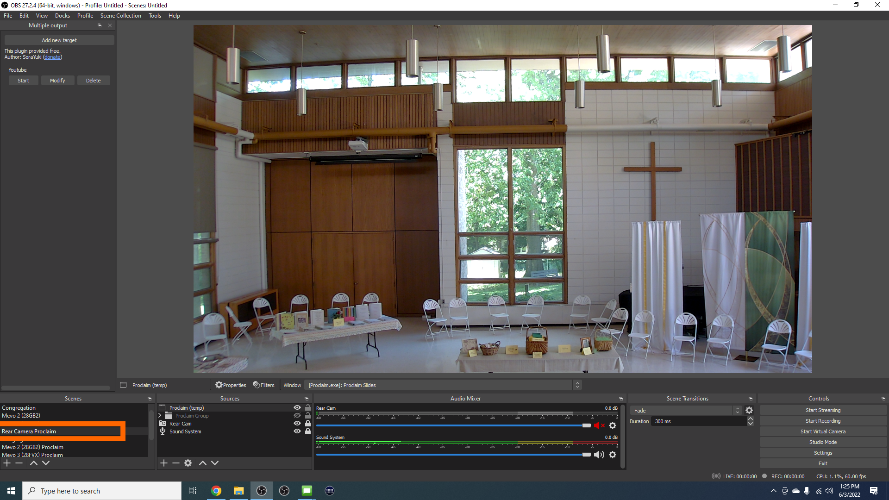
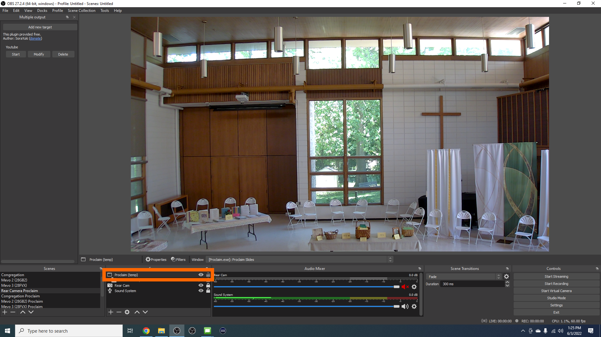
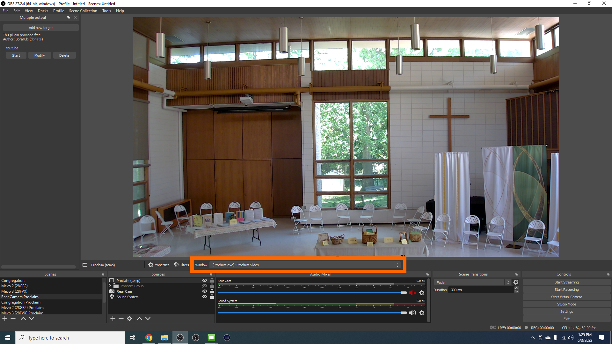
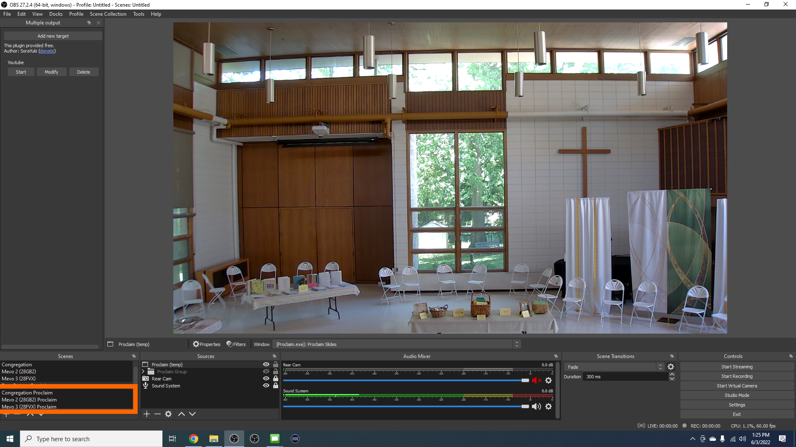
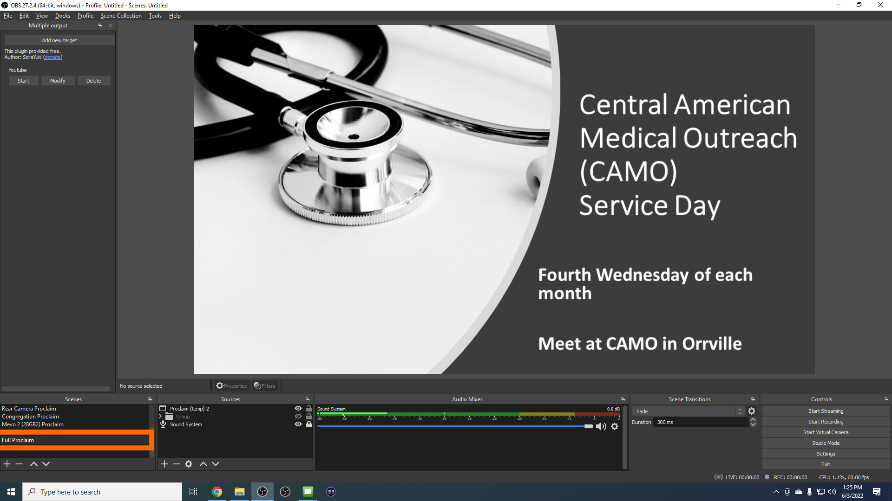
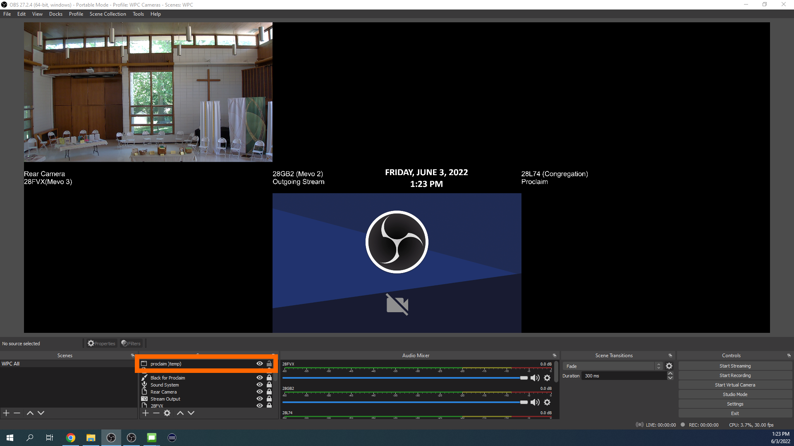

# Fixing Proclaim for OBS Studio

OBS Studio and capturing Proclaim is currently having some issues that an effective fix has yet to have been found. Each time you put Proclaim in "On Air" mode OBS Studio is not picking it up and capturing the slides. Each time you take Proclaim out of and restart "On Air" mode you will have to do this fix. Follow the instructions below to get the capture for livestreaming. 

---

## 1. Start "On Air" Mode
 - With Proclaim open to the current presentation, start "On Air" mode. This can be done either with OBS open or closed.
   

## 2. "Rear Camera Proclaim" Fix
 - In OBS Studio, navigate to the scene "Rear Camera Proclaim"
  
 - Click on "Proclaim (temp)".
  
 - It brings up a box between where just above the scenes. Click the dropdown for "Window" where it says "[Proclaim.exe] Proclaim Slides".
  
 - Click on one of the listings in the dropdown that says "[Proclaim.exe] Proclaim Slides". There will be two. If one brings up a black screen, click on the other one.

## 3. Verify Mevo Scenes
 - Verify that Proclaim shows up in the three Mevo scenes.
  
 - If not, follow step 2 again in the three Mevo scenes.

## 4. "Full Proclaim" Fix
 - Navigate to the "Full Proclaim" scene.
  
 - Follow step 2 again for the "Proclaim (temp) 2" item.

## 5. "Proclaim Muted" Fix
 - Navigate to the "Proclaim Muted" scene.
  
 - Follow step 2 again for the "Proclaim (temp) 3" item.

## 6. "WPC All" Fix
 - In the OBS All Cameras Instance, do the following for the "WPC All" scene.
  
 - Follow step 2 again for the "proclaim )temp)" item.